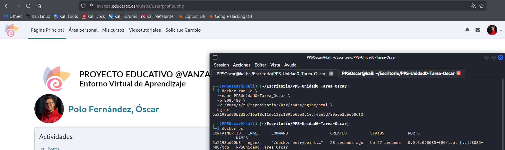
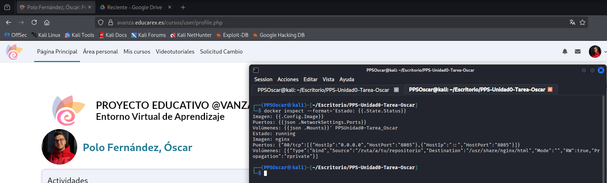
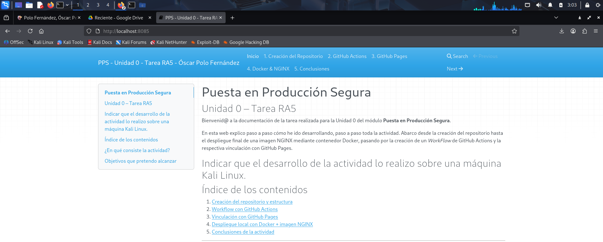

# Desarrollo completo del apartado Docker

En este apartado documento y recopilo **todo el proceso** realizado en el apartado de Docker, incluyendo instalación, comandos utilizados y comprobaciones.

---

# 1. Preparación del entorno

En primer lugar, compruebo que Docker esté instalado:

```
docker --version
```
En caso de no estar instalado, podemos instalarlo con los siguientes comandos:

```
sudo apt update
sudo apt install -y docker.io
# instalamos también docker-cli 
sudo apt install docker-cli
docker
# Nos debe de mostrar la versión de docker instalada
sudo usermod -aG docker PPSOscar
systemctl restart docker.socket
systemctl restart docker.service
```

Compruebo que el servicio está en funcionamiento:

```bash
docker ps
```


---

#2. Obtención de los archivos HTML (rama `gh-pages`)

La documentación generada por MkDocs no se encuentra en la rama _main_, sino en la rama _gh-pages_, producida automáticamente por GitHub Actions.

Cambio a la rama _gh-pages_ y listo su contenido:

```
git fetch
git checkout gh-pages
ls -la
```
Rercuerdo que el comando _git fetch_ descarga del repositorio remoto la información nueva


---

#3. Ejecuto del contenedor NGINX

Una vez situado en la rama _gh-pages_, levanto el contenedor NGINX utilizando _bind mount_. De esta forma, Docker monta una carpeta mi máquina local dentro del contenedor, en tiempo real.

Lo hago ejecutando estos comandos:

```
docker run -d \  
 --name PPSUnidad0-Tarea_Oscar  
 -p 8085:80 \  
 -v /home/PPOscar/Escritorio/PPS-Unidad0-Tarea-Oscar:/usr/share/nginx/html \  
 nginx
docker ps
```

A continuación, explico lo que realiza el comando, por partes:

- _docker run -d_ --> Ejecuta el contenedor en segundo plano.
- _--name_ --> Es el nombre del contenedor.
- _-p 8085:80_ --> El puerto 80 queda como el 8085 en mi máquina local.
- _-v ruta:/usr/share/ngix/html_ --> Monta la carpeta actual en _index.html_
- _-nginx_ --> Es la imagen del servidor NGINX.
- _docker ps_ --> Muestro los contenedores en ejecución en mi máquina.



--- 
## 3.1 Inspecciono configuración del contenedor

Con el comando _docker inspect_ obtengo toda la información del contenedor.

```
docker inspect PPSUnidad0-Tarea_Tu_nombre
```


Dentro de toda la información obtenida, he utilizado unos filtros para, con _docker inspect_ mostrar únicamente información del volumen montado, la imagen utilizada, los puertos expuestos y el estado del contenedor:

```
docker inspect --format='Estado: {{.State.Status}}
Imagen: {{.Config.Image}}
Puertos: {{json .NetworkSettings.Ports}}
Volúmenes: {{json .Mounts}}' PPSUnidad0-Tarea_Oscar
```


---

### 3.1.1 Visualizar la documentación

Para comprobar que la documentación se muestra correctamente desde NGINX, accedo a mi localhost por el puerto 8085:

```
http://localhost:8085
```



---

# 4. Parar y eliminar el contenedor

Una vez finalizado el trabajo com el contenedor, procedo a detenerlo de forma controlada y a eliminarle.


---
