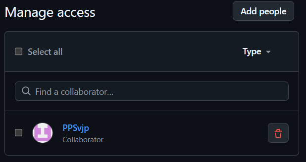
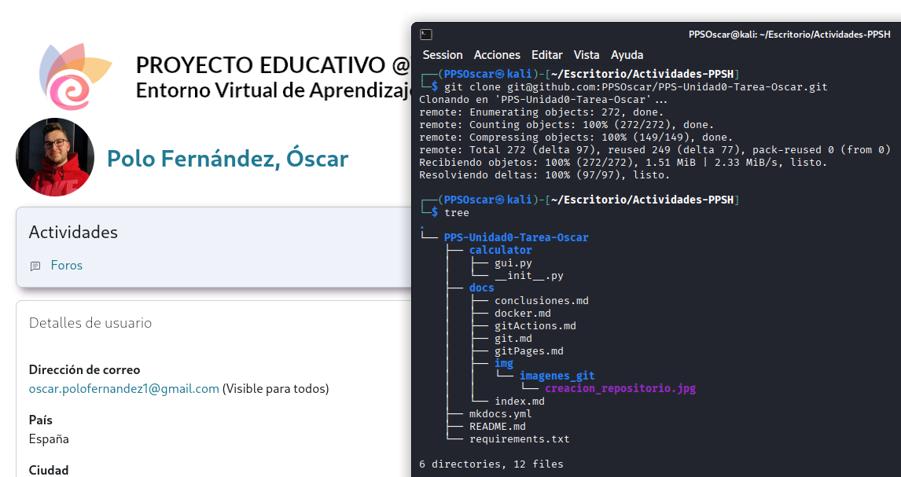

#1. Git — Creación del Repositorio y estructura

En este apartado documento y recopilo **todo el desarrollo del apartado Git**, explicando paso a paso cómo he creado el repositorio, cómo he clonado en máquina local y cómo he construido la estructura de directorios y archivos. También muestro parte de la creación del contenido de la documentación.

---

#1. Objetivos del apartado Git

Incluyo en este apartado:

- Creación y clonación de  un repositorio en GitHub.
- Organización de la estructura de un repositorio.
- Realización de _commits_ y subida de cambios a repositorio remoto.
- Añadir colaboradores.
- COnfiguración de Git en local.

Es la base sobre la cual se construyo toda la actividad.

---

#2. Creación del repositorio en GitHub

En primer lugar, creo el repositorio en [GitHub](https://github.com/):


1. En mi cuenta de GitHub --> **New repository**.
2. Asigno el nombre al repositorio: PPS-Unidad0-Tarea-Oscar
3. Selecciono la visibilidad --> **Public**. 
4. Añado el archivo README.

---

#3. Añadir colaborador al repositorio 

Para permitir acceso al repositorio a otros usuarios, los añado como colaboradores. En este caso, únicamente al usuario de mi profesor:

Para añadir colaboradores:

```
Repositorio --> Settings --> Collaborators --> Add collaborator
```

Muestro el usuario de mi profesor ya añadido como colaborador:


---

#4. Clonación del repositorio en mi máquina.

Indicar en este punto que la actividad la estoy realizando en una máquina Kali Linux.

Antes de realizar la clonación del repositorio, es imprescindible realizar estos dos pasos previos:

- Inicializar las variables

```
Tu_nombre=PPSOscar
Tu_mail_github=oscar.polofernandez1@gmail.com
Tu_usuario_github=PPSOscar

git config --global user.name PPSOscar
git config --global user.email oscar.polofernandez1@gmail.com
git config --global init.defaultBranch main
git config --global core.editor nano
```

- Generar la clave SSH

```
ssh-keygen -t ed25519 -C $Tu_mail_github
# Iniciamos el agente en segundo plano
eval "$(ssh-agent -s)"
#Nos mostrará un mensaje como 
#Agent pid 59566 ssh-add ~/.ssh/id_ed25519
```
Una vez generada la clave SSH nos iremos a nuestra cuenta de GitHub, apartado **Settings** --> **SSH and GPG keys** --> **New SSH key** --> Pegamos nuestra clave SSH y guardamos.

De esta forma, mi máquina Kali Linux queda vinculada a través de SSH con mi repositorio remoto. Listo para clonar.


Para clonar el repositorio, me sitúo en el directorio local en el que quiera tener guardada la actividad y ejecuto en la terminal el siguiente comando:

```
git clone git@github.com:PPOscar/PPS-Unidad0-Tarea-Oscar.git
```
**LA URL se obtiene en nuestro repositorio de GitHub --> Code --> SSH**

A continuación muestro la clonación del repositorio y la estructura inicial clonada mediante el comando _tree_:




* Para ver los archivos ocultos del repositorio, como el .git, hay que ejecutar el comando _tree -a_.

---

#5. Creación de la estructura del repositorio

Creo la estructura que me pide la actividad:

```
# El directorio principal
mkdir PPS-Unidad0-Tarea-Oscar

# Me situo en el directorio principal
cd PPS-Unidad0-Tare-Oscar

# Creo carpetas principales
mkdir calculator
mkdir docs
mkdir .github
mkdir .github/workflows

# Creo archivos dentro de calculator/
touch calculator/__init__.py
touch calculator/gui.py

# Creo archivos dentro de docs/
touch docs/index.md
touch docs/git.md
touch docs/gitActions.md
touch docs/gitPages.md
touch docs/docker.md
touch docs/conclusiones.md
touch docs/img

# Creao archivos raíz
touch mkdocs.yml
touch requirements.txt

# Creao archivo de workflow
touch .github/workflows/CreacionDocumentacion.yml
```

De esta forma queda preparada toda la estructura inicial de la actividad. Nos debería quedar como en la siguiente imagen.


---

#6. Primer Commit y subida al repositorio

Después de crear la estructura, hago la primera subida al repositorio:

* _git add ._ --> Prepara todos los cambios realizados en archivos y carpetas.
* _gitt commit -m ""_ --> Crea un punto de guardado en el historial del repositorio. 
* _git push origin main_ --> Envía todos los cambios al repositorio remoto. En este caso, a la rama main.
* _git status_ --> Muestra el estado actual del repositorio.

```
git add .
git commit -m "Estructura inicial de la actividad"
git push origin main
git status
```

Este commit marca el punto inicial de la actividad, con todos los archivos iniciales.


---
**En este apartado asiento la base para trabajar adecuadamente con automatización, publicación y despliegue en los apartados siguientes.
---
