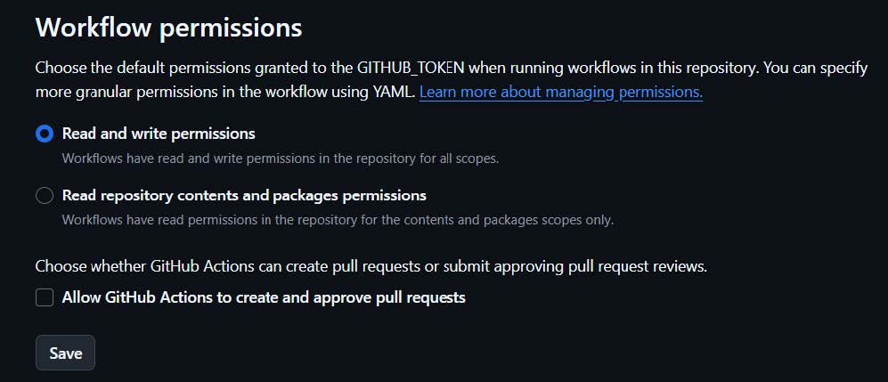

# GitHub Actions – Automatización con Workflow

En este apartado documento y recopilo  **todo el desarrollo del apartado GitHub Actions**, explicando paso a paso cómo he configurado el _workflow_ que genera la documentación con MkDocs y la publica automáticamente en la rama `gh-pages`.

---

#1. Objetivo del workflow

Incluyo en este apartado:

- Instalación de  MkDocs en un _runner_ de GitHub Actions.
- Construcción automática de la documentación ubicada en _docs/_.
- Generación del directorio _site/_ con el resultado final.
- Publicación de esos archivos en la rama _gh-pages_.
- Actualización de  GitHub Pages sin intervención manual.

Con este proceso se consigue que cada actualización del repositorio sea un despliegue automático.

---

#2. Ubicación del archivo del workflow

El archivo se crea dentro del siguiente directorio. Ya le he creado en la creación de la estructura del repositorio.

```
.github/workflows/CreacionDocumentacion.yml
```

Este archivo _.yml_ es el que automatiza la creación y publicación de la documentación MkDocs.

---

#3. Contenido y explicación del archivo YAML

El contenido del archivo _.yml_ es el siguiente:

```
yaml
name: build-mkdocs

on:
  push:
    branches:
      - main

jobs:
  deploy:
    runs-on: ubuntu-latest

    steps:
      - name: Checkout
        uses: actions/checkout@v3

      - name: Setup Python
        uses: actions/setup-python@v4
        with:
          python-version: '3.10'

      - name: Install dependencies
        run: |
          python -m pip install --upgrade pip
          pip install mkdocs

      - name: Build docs
        run: mkdocs build --clean

      - name: Deploy to GitHub Pages
        uses: peaceiris/actions-gh-pages@v3
        with:
          github_token: ${{ secrets.GITHUB_TOKEN }}
          publish_dir: ./site
          publish_branch: gh-pages
```

A continuación procedo a comentar por partes el funcionamiento de este archivo:

##3.1 Activación del workflow

```
yaml
on:
  push:
    branches:
      - main
```

* Esto significa que cada vez que se haga un _git push_ a la rama _main_, el workflow se activará automáticamente.

---

## 3.2 Preparación del entorno

El _runner_ (el que ejecuta el _workflow_) utilizado es Ubuntu:

```
yaml
runs-on: ubuntu-latest
```

A continuación, se descargan los archivos del repositorio:

```
yaml
uses: actions/checkout@v3
```

Se instala Python:

```
yaml
uses: actions/setup-python@v4
with:
  python-version: '3.10'
```
---

##3.3 Instalación de MkDocs

Se instala MKDocs. MkDocs es quien convierte MarkDown en HTML.

```
yaml
pip install mkdocs
```
---

##3.4 Construcción de la documentación

Se ejecuta lo siguiente:

```
yaml
mkdocs build --clean
```

Este comando realiza lo siguiente:

- Lee el contenido de _docs/_
- Lo transforma en HTML
- Lo almacena en la carpeta _site/_
- Limpia versiones anteriores

---

##3.5 Publicación en GitHub Pages

Se usa la acción _peaceiris/actions-gh-pages_:

```
yaml
uses: peaceiris/actions-gh-pages@v3
with:
  github_token: ${{ secrets.GITHUB_TOKEN }}
  publish_dir: ./site
  publish_branch: gh-pages
```

Esto lo que hace es publicar la carpeta _site/_ en la rama _gh-pages_ de manera automática.


A continuación muestro una captura en la que muestro parte de mi archivo _.yml_:


Tras modificar el archivo _.yml_ subo los cambios al repositorio.

---

# 6 Ejecución del workflow

Una vez hemos subido el _.yml_ a nuestro repositorio, desde la pestaña **Actions** de nuestra cuenta de GitHub podemos ver los logs de ejecución de los diferentes apartados que he comentado en el punto anterior. Si hay algún error se nos mostrará, y si se ejecuta correctamente se marcará con un check verde tras finalizar la ejecución.

Muestro los logs de mi _workflow_:


## 6.1 Problema con los permisos.

Es posible que la ejecución del _workflow_ de un error en el log relacionado con los permisos. Esto es debido a que, de forma predeterminada, en las cuentas de GitHub los permisos de los _workflows_ no están activados para lectura y escritura. Para solucionarlo:

* En mi  repositorio de GitHub --> Settings --> Actions --> General --> Permisos Workflow --> Read and Write



---
