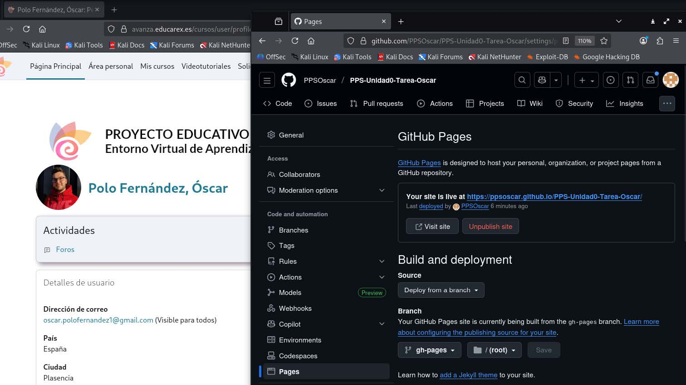
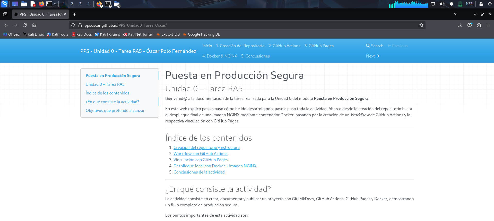
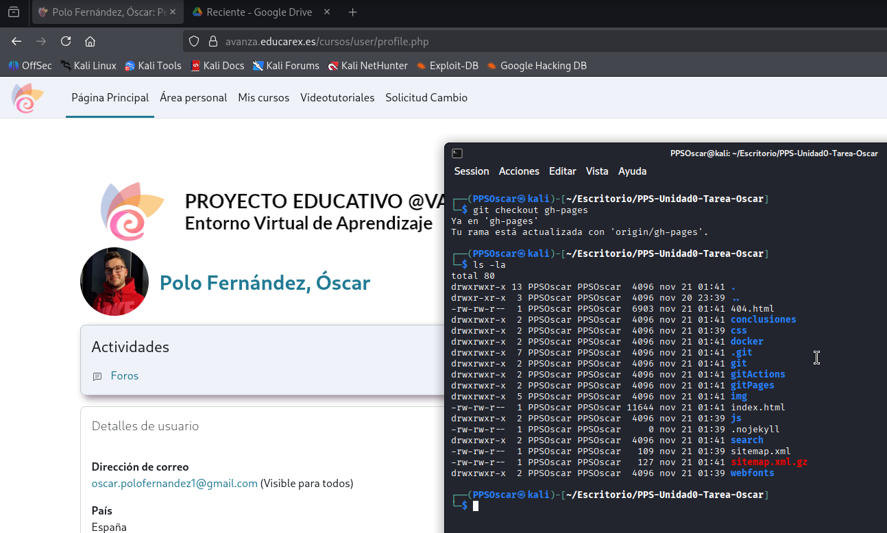

#3. Publicación de la Documentación con GitHub Pages

En este apartado documento y recopilo **todo el desarrollo del apartado GitHub Pages**, explicando cómo he configurado la publicación automática de la documentación generada con MkDocs en la rama _gh-pages_.

---

#1. Objetivo de GitHub Pages

Incluyo en este apartado:

- Publicación de la web generada por MkDocs.
- Utilización de la rama _gh-pages_ (creada automáticamente por GitHub Actions).
- Permitir el acceso público a la documentación desde cualquier navegador.
- Mantener la web siempre actualizada de forma automática.

---

#2. Confirmar que tengo la rama `gh-pages`

GitHub Pages funciona utilizando una rama especial llamada con el mismo nombre

Esta rama **no se crea manualmente**, sino que la genera automáticamente el workflow de GitHub Actions tras ejecutar _mkdocs build_ (comentado en el apartado GitHub Actions, en la creación del archivo _.yml_).

Compruebo que la rama existe con el siguiente comando:

```
git fetch
git branch -a
```
En mi caso, se muestran ambas ramas y se indica con * que estoy situado en la rama _main_.


---

#3. Configuración de GitHub Pages

Una vez que he comprobado que tengo la rama, configuro GitHub Pages desde mi repositorio de GitHub:

1. Voy a **Settings**.
2. Selecciono la opción **Pages** en el menú lateral.
4. En *Source* selecciono:

   - **Branch:** `gh-pages`
   - **Folder:** `/ (root)`

5. Guardo la configuración.

GitHub muestra la URL pública donde se publicará la documentación.



---

#4. URL - github.io

Mi URL de acceso a la documentación es la siguiente:

```
https://ppsoscar.github.io/PPS-Unidad0-Tarea-Oscar/gitPages/
```
[github.io](https://ppsoscar.github.io/PPS-Unidad0-Tarea-Oscar/gitPages/)

Es esta URL:

- _ppsoscar_ = mi nombre de usuario de GitHub
- _PPS-Unidad0-Tarea-Oscar_ = nombre del repositorio

Al abrir esa URL, mi web generada por MkDocs está disponible públicamente.



---

#5. Verificación del funcionamiento

Para comprobar que GitHub Pages está sirviendo correctamente la documentación, ejecuto lo siguiente:


```
git checkout gh-pages
ls -la
```



---

